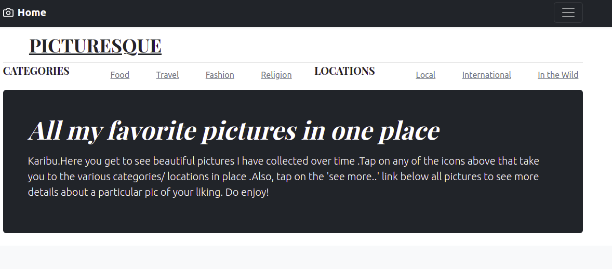
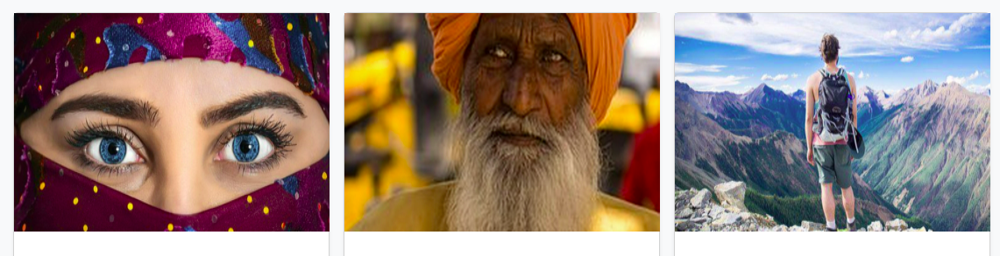
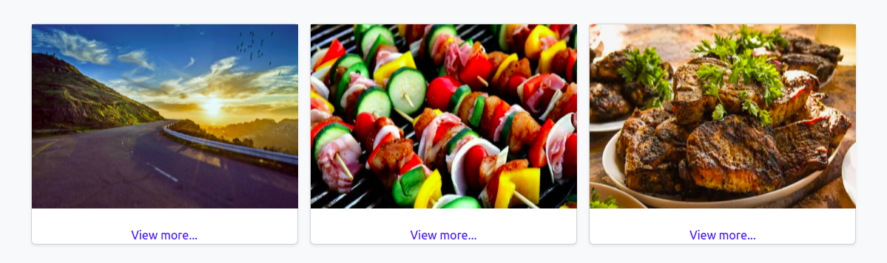
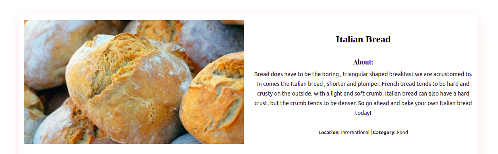

**SNEAK PIC**

**Project Description**

Picturesque is a Photo Gallery application showcasing a collection of my favourite pictures built using Python - Django.

**Overview**

Users get to view photos uploaded by admin.

Users can see photos based on the location and category, by clicking on the listed icons on the menu as shown in the above diagram.

Users can also copy the link to a photo by right clicking on the diagram and choose the "copy image link" then share said image at their discretion.

**BDD**

View photos of interest

 

Scroll up and down and click on "view more" below the picture 

Get a display of the picture with the name, description ,location and category

Copy the link to a photo by right clicking on the diagram and choose the "copy image link" then share said image at their discretion.

View pictures by location and category by clicking on the icons on the navbarand get the photo with the description

**Getting Started**

To clone the repository, run:

git clone https://github.com/MugureNjunge/picturesque

Then navigating to the cloned directory:

cd gallery

**Requirements**

The Pictursque project requires one to understand :

Django Framework

Python3.8

Postgres

Virtual environment

**Setup and installation**

Install and activate virtual environment

Install dependancies

Create the Database

- psql

- CREATE DATABASE <name>

Create .env file

**Run initial Migration**

python3.8 manage.py makemigrations 

python3.8 manage.py migrate

**Run the application**

python3.8 manage.py runserver

Follow linnk provided after running to open app on local host:8000

**Deployment**

The application is deployed on Heroku and is live on this link: https://picsque.herokuapp.com/

**Built With/Technologies**

Django 4 - Back end logic

Bootstrap - Application design

Pillow - Upload images

**Contact:**

Incase of any question or contributions, you can contact me through: maureen.njunge@student.moringaschool.com

**License**

This project is licensed under the terms of the MIT license

**Copyright (c) 2022 Mugure Njung'e**

